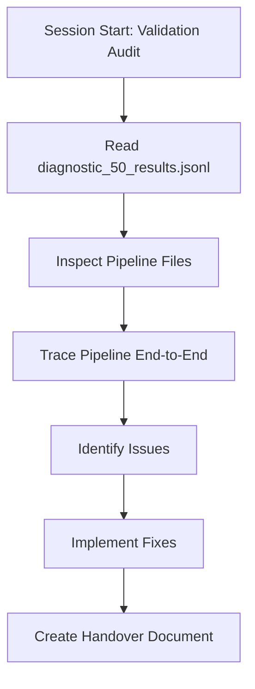
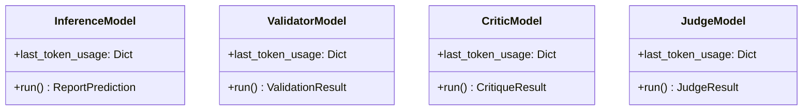
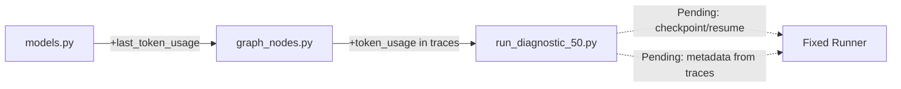
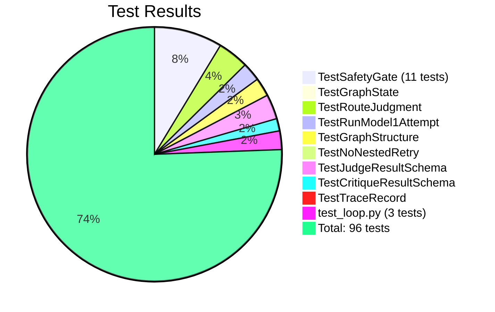

# Diagnostic 50 Validation Pipeline - Handover Document



---

## 1. Session Overview

**Objective**: Validate diagnostic_50 results and fix pipeline metadata issues  
**Date**: 2026-09-23  
**Mode**: Architect → Code → Docs-Specialist  
**Repository**: `/Users/sai-work/Documents/gitCode/new/orchestrate-agent-lab`

---

## 2. Issues Identified

### 2.1 Critical Issues (Blocking)

| # | Issue | Impact | Root Cause | Location |
|---|-------|--------|------------|----------|
| 1 | **Only 41/50 records processed** | 9 missing records | Script interrupted externally (timeout/OOM) after record 41; no checkpoint/resume | `run_diagnostic_50.py:138-368` |
| 2 | **Identical prompt hashes** | All 41 records | Hashing only static system prompt, not full rendered prompt | `run_diagnostic_50.py:335-337` |
| 3 | **Empty `attempts` arrays** | All 41 records | Runner doesn't populate `state["attempts"]` (legacy `run_report()` does) | `run_diagnostic_50.py:263-286` |
| 4 | **`retry_count: -1`** | All 41 records | `len([]) - 1 = -1` | `run_diagnostic_50.py:319` |
| 5 | **Zero `latency_seconds`** | All 41 records | Summed from empty `attempts` | `run_diagnostic_50.py:333` |
| 6 | **Empty `token_usage`** | All 41 records | Hardcoded `{}` | `run_diagnostic_50.py:334` |
| 7 | **Empty `model1_prediction`/`model2_validation`** | All 41 records | Index into empty `attempts` | `run_diagnostic_50.py:315-316` |
| 8 | **Empty `policy_conventions_used`/`unresolved_policy_flags`** | All 41 records | Hardcoded `[]` | `run_diagnostic_50.py:321-322` |

### 2.2 Working Correctly (No Action Needed)

| Component | Status | Evidence |
|-----------|--------|----------|
| Safety Gate (9 checks) | ✅ Working | 11 unit tests pass; trace shows `safety_gate_failure` entries |
| LangGraph 5-node orchestration | ✅ Working | Initialize → Inference → Critic → Judge → Finalize |
| TF-IDF Retrieval | ✅ Working | `retrieve_excluding()` prevents leakage; top_k=8 |
| Pydantic Schemas | ✅ Working | Strict validation with `extra="forbid"` |
| PF_OA Flattening | ✅ Working | `_flatten_nested_pf_oa()` in models.py:76-119 |
| `import json` in loop.py | ✅ Fixed | Line 4 present |

---

## 3. Fixes Implemented

### 3.1 Model Classes (`models.py`) - Token Usage Capture



**Changes**: All 4 model classes now capture `prompt_tokens`/`completion_tokens` from API response into `last_token_usage` dict.

### 3.2 Graph Nodes (`graph_nodes.py`) - Trace Records with Token Usage

**Updated 3 trace record creations**:
- `inference_node` (line ~167): Added `input_tokens`/`output_tokens` from `inference_model.last_token_usage`
- `critic_node` (line ~295): Added token usage from `critic_model.last_token_usage`
- `judge_node` (line ~380): Added token usage from `judge_model.last_token_usage`

---

## 4. Pending Fixes (Runner - `run_diagnostic_50.py`)

### 4.1 Checkpoint/Resume (Priority 1)
```python
# Load already processed StudyInstanceUIDs from results file
processed_uids = set()
if results_path.exists():
    with results_path.open() as f:
        for line in f:
            data = json.loads(line)
            processed_uids.add(data["StudyInstanceUID"])

# Skip in loop
if report_id in processed_uids:
    print(f"  Skipping {report_id} (already processed)")
    continue
```

### 4.2 Prompt Hashes from Traces (Priority 1)
```python
# Extract from trace records (already correct in traces)
inference_traces = [t for t in trace_records if t.graph_node == "inference" and t.stage == "inference"]
prompt_hash_inference = inference_traces[0].prompt_hash if inference_traces else ""
```

### 4.3 Build Attempts from Traces (Priority 1)
```python
# Group trace_records by attempt number
attempts_by_num = defaultdict(list)
for trace in trace_records:
    if trace.attempt > 0:
        attempts_by_num[trace.attempt].append(trace)

# Build attempts_detail from grouped traces
for attempt_num in sorted(attempts_by_num.keys()):
    traces = attempts_by_num[attempt_num]
    # Extract prediction/validation from response_hash or re-parse
```

### 4.4 Derive retry_count from Traces (Priority 1)
```python
inference_attempts = len(set(t.attempt for t in trace_records if t.graph_node == "inference"))
retry_count = max(0, inference_attempts - 1)
```

### 4.5 Sum Latency from Traces (Priority 1)
```python
latency_seconds = sum(t.latency_seconds or 0 for t in trace_records)
```

### 4.6 Aggregate Token Usage from Traces (Priority 1)
```python
token_usage = {
    "input_tokens": sum(t.input_tokens or 0 for t in trace_records),
    "output_tokens": sum(t.output_tokens or 0 for t in trace_records),
}
```

### 4.7 Extract Model Predictions from Last Attempt (Priority 1)
```python
last_attempt = max(t.attempt for t in trace_records if t.graph_node == "inference")
# Get prediction from trace response_hash or state.final_prediction
```

### 4.8 Parse Policy Flags from Critiques (Priority 2)
```python
policy_conventions_used = []
unresolved_policy_flags = []
for trace in trace_records:
    if trace.graph_node == "critic" and trace.error:
        # Parse safety_gate_failure or critique issues
        # Extract UNRESOLVED_POLICY, REPORT_AMBIGUITY issue types
```

### 4.9 Better Error Handling (Priority 2)
- Per-record timeout with `signal.alarm()` or `asyncio.wait_for()`
- Progress logging to file (not just stdout)
- Graceful degradation on API errors

---

## 5. File Changes Summary



| File | Lines Changed | Description |
|------|---------------|-------------|
| `models.py` | ~183-568 | Added `last_token_usage` to all 4 model classes |
| `graph_nodes.py` | ~167, 295, 380 | Added token usage to 3 trace record creations |
| `run_diagnostic_50.py` | **PENDING** | Checkpoint/resume, metadata from traces, error handling |

---

## 6. Test Coverage



**All 96 tests pass** ✅

---

## 7. Next Steps for Implementation

1. **Apply checkpoint/resume** to `run_diagnostic_50.py` (load processed UIDs from results file)
2. **Replace metadata computation** with trace-based aggregation
3. **Add per-record timeout** and progress file logging
4. **Run fixed validation** on all 50 records
5. **Verify**: 50 results, non-empty attempts, correct retry_count (0-2), unique prompt hashes

---

## 8. Key Files Reference

| File | Purpose |
|------|---------|
| `experiments/ragset_report_inference_experiment/runners/run_diagnostic_50.py` | Main runner (needs fixes) |
| `experiments/ragset_report_inference_experiment/src/ragset_inference/models.py` | Model classes (fixed) |
| `experiments/ragset_report_inference_experiment/src/ragset_inference/graph_nodes.py` | Graph nodes (fixed) |
| `experiments/ragset_report_inference_experiment/src/ragset_inference/loop.py` | Safety gate, retry logic |
| `experiments/ragset_report_inference_experiment/src/ragset_inference/schemas.py` | Pydantic schemas |
| `experiments/ragset_report_inference_experiment/results/validation/diagnostic_50_results.jsonl` | Current results (41 records) |
| `experiments/ragset_report_inference_experiment/results/validation/diagnostic_50_trace.jsonl` | Trace records (248 entries) |
| `.kilo/plans/diagnostic_50_validation_fixes.md` | Detailed fix plan |

---

## 9. Session Context

**Previous Commits**:
- `b84e62f` - STEP 5: Safety gates for Critic output validation (9 checks)
- `4ac8a97` - ST6: Major LangGraph implementation
- Debug fix: `import json` added to `loop.py:4`

**Current State**: 
- Models & graph nodes fixed for token usage
- Runner needs checkpoint/resume and trace-based metadata aggregation
- 9 records missing from CSV (records 42-50)

---

*Generated: 2026-09-23T19:20:57Z*  
*Session: Diagnostic 50 Validation Audit & Fixes*